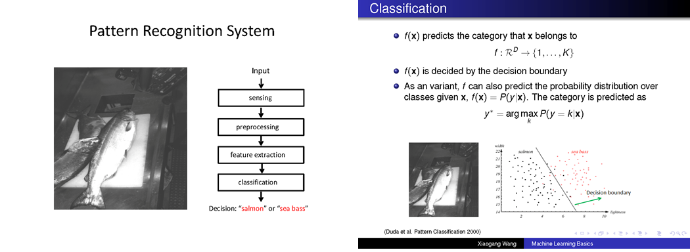
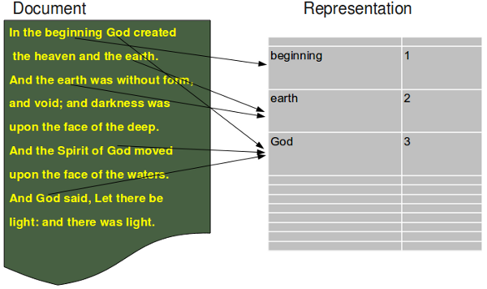
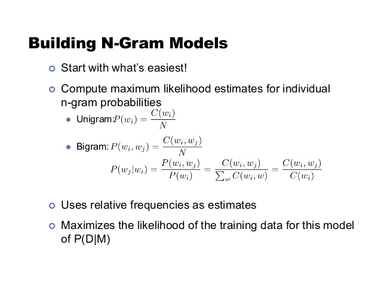
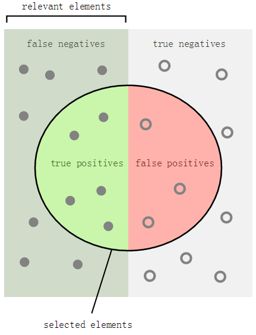

# Lab 2 Text Classification
*Prepared by [Guangcan MAI](http://www.comp.hkbu.edu.hk/~csgcmai)*

*For COMP4075/7630, Semester 1, 2016-2017, in Hong Kong Baptist Univeristy*

## Objective:
This lab aims to introduce to you how to classify text acquired from Web. In particular, we will focus on reviews of entertainment such as movie, restaurant and services. With this lab, you should be able to understand the following concepts and able to using Python programming language for their corresponding implementation.

1. Basic pipeline for a pattern recognition system
2. Basic techniques for pre-processing natural language in text
3. Basic representations (features) for natural language in text
4. Basic classifier for text classification
5. Fundmental metris for classification model evaluation

## Basic pipeline for a pattern recognition systems
*Slides from ELEG5040, CUHK, Introduction to Deep Learning, by Prof. Xiaogang Wang 


## Basic Naïve Bayes Text Classifier for movie reviews
[Reference](http://streamhacker.com/2010/05/10/text-classification-sentiment-analysis-naive-bayes-classifier/)

### Bag-of-words model (representations / features)
A simplified version of the bag-of-words model is used here for the movie review analysis. Different from the bag-of-words models that calculate the word frequency in each document, we instead use the model that **whether the words existed** in the document. 


### [NLTK Package](http://www.nltk.org/)
> NLTK is a leading platform for building Python programs to work with human language data. It provides easy-to-use interfaces to over 50 corpora and lexical resources such as WordNet, along with a suite of text processing libraries for classification, tokenization, stemming, tagging, parsing, and semantic reasoning, wrappers for industrial-strength NLP libraries, and an active [discussion forum](http://groups.google.com/group/nltk-users).

* Python package that implements many standard NLP data structures, algorithms
* First developed in 2001 as part of a CL course at University of Pennsylvania
* Many contributors since then
- led by Steven Bird, Edward Loper, Ewan Klein
* Open-source

### Let us import the nltk module and download a movie reviews corpus by executing nltk.download(). 


```python
import nltk
nltk.download()
```

    NLTK Downloader
    ---------------------------------------------------------------------------
        d) Download   l) List    u) Update   c) Config   h) Help   q) Quit
    ---------------------------------------------------------------------------
    Downloader> d
    
    Download which package (l=list; x=cancel)?
      Identifier> movie_reviews
        Downloading package movie_reviews to
            /home/comp/csgcmai/nltk_data...
          Package movie_reviews is already up-to-date!
    
    ---------------------------------------------------------------------------
        d) Download   l) List    u) Update   c) Config   h) Help   q) Quit
    ---------------------------------------------------------------------------
    Downloader> d
    
    Download which package (l=list; x=cancel)?
      Identifier> stopwords
        Downloading package stopwords to /home/comp/csgcmai/nltk_data...
          Package stopwords is already up-to-date!
    
    ---------------------------------------------------------------------------
        d) Download   l) List    u) Update   c) Config   h) Help   q) Quit
    ---------------------------------------------------------------------------
    Downloader> q


    True


### Import the classification tools, basic utility functions and the corpus, i.e., movie reviews, which are just downloaded.


```python
from nltk.corpus import movie_reviews
import nltk.classify.util
from nltk.classify import NaiveBayesClassifier
from __future__ import print_function
```

### Take a look on the movie reviews, the way for reading the corpus might different from corpus to corpus, for details, please refer to the official documents or some useful examples


```python
negids = movie_reviews.fileids('neg')
posids = movie_reviews.fileids('pos')

for w in movie_reviews.words(posids[0]):
    print('%s '%w, end="")
```

    films adapted from comic books have had plenty of success , whether they ' re about superheroes ( batman , superman , spawn ) , or geared toward kids ( casper ) or the arthouse crowd ( ghost world ) , but there ' s never really been a comic book like from hell before . for starters , it was created by alan moore ( and eddie campbell ) , who brought the medium to a whole new level in the mid ' 80s with a 12 - part series called the watchmen . to say moore and campbell thoroughly researched the subject of jack the ripper would be like saying michael jackson is starting to look a little odd . the book ( or " graphic novel , " if you will ) is over 500 pages long and includes nearly 30 more that consist of nothing but footnotes . in other words , don ' t dismiss this film because of its source . if you can get past the whole comic book thing , you might find another stumbling block in from hell ' s directors , albert and allen hughes . getting the hughes brothers to direct this seems almost as ludicrous as casting carrot top in , well , anything , but riddle me this : who better to direct a film that ' s set in the ghetto and features really violent street crime than the mad geniuses behind menace ii society ? the ghetto in question is , of course , whitechapel in 1888 london ' s east end . it ' s a filthy , sooty place where the whores ( called " unfortunates " ) are starting to get a little nervous about this mysterious psychopath who has been carving through their profession with surgical precision . when the first stiff turns up , copper peter godley ( robbie coltrane , the world is not enough ) calls in inspector frederick abberline ( johnny depp , blow ) to crack the case . abberline , a widower , has prophetic dreams he unsuccessfully tries to quell with copious amounts of absinthe and opium . upon arriving in whitechapel , he befriends an unfortunate named mary kelly ( heather graham , say it isn ' t so ) and proceeds to investigate the horribly gruesome crimes that even the police surgeon can ' t stomach . i don ' t think anyone needs to be briefed on jack the ripper , so i won ' t go into the particulars here , other than to say moore and campbell have a unique and interesting theory about both the identity of the killer and the reasons he chooses to slay . in the comic , they don ' t bother cloaking the identity of the ripper , but screenwriters terry hayes ( vertical limit ) and rafael yglesias ( les mis ? rables ) do a good job of keeping him hidden from viewers until the very end . it ' s funny to watch the locals blindly point the finger of blame at jews and indians because , after all , an englishman could never be capable of committing such ghastly acts . and from hell ' s ending had me whistling the stonecutters song from the simpsons for days ( " who holds back the electric car / who made steve guttenberg a star ? " ) . don ' t worry - it ' ll all make sense when you see it . now onto from hell ' s appearance : it ' s certainly dark and bleak enough , and it ' s surprising to see how much more it looks like a tim burton film than planet of the apes did ( at times , it seems like sleepy hollow 2 ) . the print i saw wasn ' t completely finished ( both color and music had not been finalized , so no comments about marilyn manson ) , but cinematographer peter deming ( don ' t say a word ) ably captures the dreariness of victorian - era london and helped make the flashy killing scenes remind me of the crazy flashbacks in twin peaks , even though the violence in the film pales in comparison to that in the black - and - white comic . oscar winner martin childs ' ( shakespeare in love ) production design turns the original prague surroundings into one creepy place . even the acting in from hell is solid , with the dreamy depp turning in a typically strong performance and deftly handling a british accent . ians holm ( joe gould ' s secret ) and richardson ( 102 dalmatians ) log in great supporting roles , but the big surprise here is graham . i cringed the first time she opened her mouth , imagining her attempt at an irish accent , but it actually wasn ' t half bad . the film , however , is all good . 2 : 00 - r for strong violence / gore , sexuality , language and drug content 

### Define our simplified bag-of-words model, i.e., whether the words exist. Display word_features


```python
def word_feats(words):
    return dict([(word, True) for word in words])
word_feats(movie_reviews.words(posids[0]))
```


    {u'"': True,
     u"'": True,
     u'(': True,
     u')': True,
     u',': True,
     u'-': True,
     u'.': True,
     u'/': True,
     u'00': True,
     u'102': True,
     u'12': True,
     u'1888': True,
     u'2': True,
     u'30': True,
     u'500': True,
     u'80s': True,
     u':': True,
     u'?': True,
     u'a': True,
     u'abberline': True,
     u'ably': True,
     u'about': True,
     u'absinthe': True,
     u'accent': True,
     u'acting': True,
     u'acts': True,
     u'actually': True,
     u'adapted': True,
     u'after': True,
     u'alan': True,
     u'albert': True,
     u'all': True,
     u'allen': True,
     u'almost': True,
     u'amounts': True,
     u'an': True,
     u'and': True,
     u'another': True,
     u'anyone': True,
     u'anything': True,
     u'apes': True,
     u'appearance': True,
     u'are': True,
     u'arriving': True,
     u'arthouse': True,
     u'as': True,
     u'at': True,
     u'attempt': True,
     u'back': True,
     u'bad': True,
     u'batman': True,
     u'be': True,
     u'because': True,
     u'been': True,
     u'before': True,
     u'befriends': True,
     u'behind': True,
     u'better': True,
     u'big': True,
     u'black': True,
     u'blame': True,
     u'bleak': True,
     u'blindly': True,
     u'block': True,
     u'blow': True,
     u'book': True,
     u'books': True,
     u'both': True,
     u'bother': True,
     u'briefed': True,
     u'british': True,
     u'brothers': True,
     u'brought': True,
     u'burton': True,
     u'but': True,
     u'by': True,
     u'called': True,
     u'calls': True,
     u'campbell': True,
     u'can': True,
     u'capable': True,
     u'captures': True,
     u'car': True,
     u'carrot': True,
     u'carving': True,
     u'case': True,
     u'casper': True,
     u'casting': True,
     u'certainly': True,
     u'childs': True,
     u'chooses': True,
     u'cinematographer': True,
     u'cloaking': True,
     u'color': True,
     u'coltrane': True,
     u'comic': True,
     u'comments': True,
     u'committing': True,
     u'comparison': True,
     u'completely': True,
     u'consist': True,
     u'content': True,
     u'copious': True,
     u'copper': True,
     u'could': True,
     u'course': True,
     u'crack': True,
     u'crazy': True,
     u'created': True,
     u'creepy': True,
     u'crime': True,
     u'crimes': True,
     u'cringed': True,
     u'crowd': True,
     u'dalmatians': True,
     u'dark': True,
     u'days': True,
     u'deftly': True,
     u'deming': True,
     u'depp': True,
     u'design': True,
     u'did': True,
     u'direct': True,
     u'directors': True,
     u'dismiss': True,
     u'do': True,
     u'don': True,
     u'dreams': True,
     u'dreamy': True,
     u'dreariness': True,
     u'drug': True,
     u'east': True,
     u'eddie': True,
     u'electric': True,
     u'end': True,
     u'ending': True,
     u'englishman': True,
     u'enough': True,
     u'era': True,
     u'even': True,
     u'features': True,
     u'film': True,
     u'films': True,
     u'filthy': True,
     u'finalized': True,
     u'find': True,
     u'finger': True,
     u'finished': True,
     u'first': True,
     u'flashbacks': True,
     u'flashy': True,
     u'footnotes': True,
     u'for': True,
     u'frederick': True,
     u'from': True,
     u'funny': True,
     u'geared': True,
     u'geniuses': True,
     u'get': True,
     u'getting': True,
     u'ghastly': True,
     u'ghetto': True,
     u'ghost': True,
     u'go': True,
     u'godley': True,
     u'good': True,
     u'gore': True,
     u'gould': True,
     u'graham': True,
     u'graphic': True,
     u'great': True,
     u'gruesome': True,
     u'guttenberg': True,
     u'had': True,
     u'half': True,
     u'handling': True,
     u'has': True,
     u'have': True,
     u'hayes': True,
     u'he': True,
     u'heather': True,
     u'hell': True,
     u'helped': True,
     u'her': True,
     u'here': True,
     u'hidden': True,
     u'him': True,
     u'holds': True,
     u'hollow': True,
     u'holm': True,
     u'horribly': True,
     u'how': True,
     u'however': True,
     u'hughes': True,
     u'i': True,
     u'ians': True,
     u'identity': True,
     u'if': True,
     u'ii': True,
     u'imagining': True,
     u'in': True,
     u'includes': True,
     u'indians': True,
     u'inspector': True,
     u'interesting': True,
     u'into': True,
     u'investigate': True,
     u'irish': True,
     u'is': True,
     u'isn': True,
     u'it': True,
     u'its': True,
     u'jack': True,
     u'jackson': True,
     u'jews': True,
     u'job': True,
     u'joe': True,
     u'johnny': True,
     u'keeping': True,
     u'kelly': True,
     u'kids': True,
     u'killer': True,
     u'killing': True,
     u'language': True,
     u'les': True,
     u'level': True,
     u'like': True,
     u'limit': True,
     u'little': True,
     u'll': True,
     u'locals': True,
     u'log': True,
     u'london': True,
     u'long': True,
     u'look': True,
     u'looks': True,
     u'love': True,
     u'ludicrous': True,
     u'mad': True,
     u'made': True,
     u'make': True,
     u'manson': True,
     u'marilyn': True,
     u'martin': True,
     u'mary': True,
     u'me': True,
     u'medium': True,
     u'menace': True,
     u'michael': True,
     u'mid': True,
     u'might': True,
     u'mis': True,
     u'moore': True,
     u'more': True,
     u'mouth': True,
     u'much': True,
     u'music': True,
     u'mysterious': True,
     u'named': True,
     u'nearly': True,
     u'needs': True,
     u'nervous': True,
     u'never': True,
     u'new': True,
     u'no': True,
     u'not': True,
     u'nothing': True,
     u'novel': True,
     u'now': True,
     u'odd': True,
     u'of': True,
     u'on': True,
     u'one': True,
     u'onto': True,
     u'opened': True,
     u'opium': True,
     u'or': True,
     u'original': True,
     u'oscar': True,
     u'other': True,
     u'over': True,
     u'pages': True,
     u'pales': True,
     u'part': True,
     u'particulars': True,
     u'past': True,
     u'peaks': True,
     u'performance': True,
     u'peter': True,
     u'place': True,
     u'planet': True,
     u'plenty': True,
     u'point': True,
     u'police': True,
     u'prague': True,
     u'precision': True,
     u'print': True,
     u'proceeds': True,
     u'production': True,
     u'profession': True,
     u'prophetic': True,
     u'psychopath': True,
     u'quell': True,
     u'question': True,
     u'r': True,
     u'rables': True,
     u'rafael': True,
     u're': True,
     u'really': True,
     u'reasons': True,
     u'remind': True,
     u'researched': True,
     u'richardson': True,
     u'riddle': True,
     u'ripper': True,
     u'robbie': True,
     u'roles': True,
     u's': True,
     u'saw': True,
     u'say': True,
     u'saying': True,
     u'scenes': True,
     u'screenwriters': True,
     u'secret': True,
     u'see': True,
     u'seems': True,
     u'sense': True,
     u'series': True,
     u'set': True,
     u'sexuality': True,
     u'shakespeare': True,
     u'she': True,
     u'simpsons': True,
     u'slay': True,
     u'sleepy': True,
     u'so': True,
     u'society': True,
     u'solid': True,
     u'song': True,
     u'sooty': True,
     u'source': True,
     u'spawn': True,
     u'star': True,
     u'starters': True,
     u'starting': True,
     u'steve': True,
     u'stiff': True,
     u'stomach': True,
     u'stonecutters': True,
     u'street': True,
     u'strong': True,
     u'stumbling': True,
     u'subject': True,
     u'success': True,
     u'such': True,
     u'superheroes': True,
     u'superman': True,
     u'supporting': True,
     u'surgeon': True,
     u'surgical': True,
     u'surprise': True,
     u'surprising': True,
     u'surroundings': True,
     u't': True,
     u'terry': True,
     u'than': True,
     u'that': True,
     u'the': True,
     u'their': True,
     u'theory': True,
     u'there': True,
     u'they': True,
     u'thing': True,
     u'think': True,
     u'this': True,
     u'thoroughly': True,
     u'though': True,
     u'through': True,
     u'tim': True,
     u'time': True,
     u'times': True,
     u'to': True,
     u'top': True,
     u'toward': True,
     u'tries': True,
     u'turning': True,
     u'turns': True,
     u'twin': True,
     u'typically': True,
     u'unfortunate': True,
     u'unfortunates': True,
     u'unique': True,
     u'unsuccessfully': True,
     u'until': True,
     u'up': True,
     u'upon': True,
     u'vertical': True,
     u'very': True,
     u'victorian': True,
     u'viewers': True,
     u'violence': True,
     u'violent': True,
     u'was': True,
     u'wasn': True,
     u'watch': True,
     u'watchmen': True,
     u'well': True,
     u'when': True,
     u'where': True,
     u'whether': True,
     u'whistling': True,
     u'white': True,
     u'whitechapel': True,
     u'who': True,
     u'whole': True,
     u'whores': True,
     u'widower': True,
     u'will': True,
     u'winner': True,
     u'with': True,
     u'won': True,
     u'word': True,
     u'words': True,
     u'world': True,
     u'worry': True,
     u'would': True,
     u'yglesias': True,
     u'you': True}


### Extracting features for negative reviews and positive reviews, respectively


```python
negfeats = [(word_feats(movie_reviews.words(fileids=[f])), 'neg') for f in negids]
posfeats = [(word_feats(movie_reviews.words(fileids=[f])), 'pos') for f in posids]
```

### Training / testing partition
* Training samples are used to train the classifier, that is, find the boundary (curve) between the positive and negative reviews
* Testing samples are used to evaluate how good is the found boundary


```python
negcutoff = len(negfeats)*3/4
poscutoff = len(posfeats)*3/4
 
trainfeats = negfeats[:negcutoff] + posfeats[:poscutoff]
testfeats = negfeats[negcutoff:] + posfeats[poscutoff:]
```

### Train the classifier (naïve Bayes) and evaluate the classification accuracy


```python
print('train on %d instances, test on %d instances' % (len(trainfeats), len(testfeats)))

classifier = NaiveBayesClassifier.train(trainfeats)
print('accuracy:', nltk.classify.util.accuracy(classifier, testfeats))

classifier.show_most_informative_features()
```

    train on 1500 instances, test on 500 instances
    accuracy: 0.728
    Most Informative Features
                 magnificent = True              pos : neg    =     15.0 : 1.0
                 outstanding = True              pos : neg    =     13.6 : 1.0
                   insulting = True              neg : pos    =     13.0 : 1.0
                  vulnerable = True              pos : neg    =     12.3 : 1.0
                   ludicrous = True              neg : pos    =     11.8 : 1.0
                      avoids = True              pos : neg    =     11.7 : 1.0
                 uninvolving = True              neg : pos    =     11.7 : 1.0
                  astounding = True              pos : neg    =     10.3 : 1.0
                 fascination = True              pos : neg    =     10.3 : 1.0
                     idiotic = True              neg : pos    =      9.8 : 1.0


## Advanced Classifiers and Feature Extraction for Entertainment Reviews
[Reference](http://blog.chapagain.com.np/machine-learning- sentiment-analysis- text- classification-using- python-nltk/)
### Read the data 
* Download the review comments from BU-Moodle and then upload to your [current folder]/data/
* Read the csv data using csv reader and then stored as a list of words


```python
import csv

posdata = []
with open('data/positive-data.csv', 'rb') as myfile:    
    reader = csv.reader(myfile, delimiter=',')
    for val in reader:
        posdata.append(val[0])        
 
negdata = []
with open('data/negative-data.csv', 'rb') as myfile:    
    reader = csv.reader(myfile, delimiter=',')
    for val in reader:
        negdata.append(val[0])

def word_split(data):    
    data_new = []
    for word in data:
        word_filter = [i.lower() for i in word.split()]
        data_new.append(word_filter)
    return data_new
```

### Preprocessing: filter out the stop words, words that will be excluded from feature words


```python
from nltk.corpus import stopwords
for w in stopwords.words('english'):
    print(w,end=" ") 
```

    i me my myself we our ours ourselves you your yours yourself yourselves he him his himself she her hers herself it its itself they them their theirs themselves what which who whom this that these those am is are was were be been being have has had having do does did doing a an the and but if or because as until while of at by for with about against between into through during before after above below to from up down in out on off over under again further then once here there when where why how all any both each few more most other some such no nor not only own same so than too very s t can will just don should now d ll m o re ve y ain aren couldn didn doesn hadn hasn haven isn ma mightn mustn needn shan shouldn wasn weren won wouldn 

### Representations: word feature, word feature with filtered words
#### Stopwords that are useful for the sentiment analysis is kept here


```python
#Update the set of stopwords
stopset = set(stopwords.words('english')) - set(('over', 'under', 'below', 'more', 'most', 'no', 'not', 'only', 'such', 'few', 'so', 'too', 'very', 'just', 'any', 'once'))

def word_feats(words):    
    return dict([(word, True) for word in words])

def stopword_filtered_word_feats(words):
    return dict([(word, True) for word in words if word not in stopset])
```

#### Extend the word feature with bigram
A **bigram** or digram is a sequence of two adjacent elements from a string of tokens, which are typically letters, syllables, or words. A bigram is an n-gram for n=2.




```python
from nltk.collocations import BigramCollocationFinder
from nltk.metrics import BigramAssocMeasures
from nltk.metrics import scores
import itertools

def bigram_word_feats(words, score_fn=BigramAssocMeasures.chi_sq, n=200):
    bigram_finder = BigramCollocationFinder.from_words(words)
    bigrams = bigram_finder.nbest(score_fn, n)
    """
    print words
    for ngram in itertools.chain(words, bigrams): 
        if ngram not in stopset: 
            print ngram
    exit()
    """    
    return dict([(ngram, True) for ngram in itertools.chain(words, bigrams)])
    
def bigram_word_feats_stopwords(words, score_fn=BigramAssocMeasures.chi_sq, n=200):
    bigram_finder = BigramCollocationFinder.from_words(words)
    bigrams = bigram_finder.nbest(score_fn, n)
    """
    print words
    for ngram in itertools.chain(words, bigrams): 
        if ngram not in stopset: 
            print ngram
    exit()
    """    
    return dict([(ngram, True) for ngram in itertools.chain(words, bigrams) if ngram not in stopset])
```


```python
ws_pos = word_split(posdata)
print("Original word features are:")
print(" ")
for w in ws_pos[1]:
    print(w,end=" ")
print(" ")
print(" ")
print("Extended word features with bigram are:")
print(" ")
ws_pos_with_bg = bigram_word_feats(ws_pos[1])
for w in ws_pos_with_bg.keys():
    print(w ,end=" ")
```

    Original word features are:
     
    i dont know why anyone eats ice cream anymore  
     
    Extended word features with bigram are:
     
    ('cream', 'anymore') ('ice', 'cream') dont anymore i ('i', 'dont') ('dont', 'know') eats ice ('know', 'why') anyone ('eats', 'ice') know ('anyone', 'eats') why ('why', 'anyone') cream 

## Train the classifier (naïve Bayes) and evaluate the performance in terms of accuracy, precision, recall, under the One-fold and N-fold cross-validation



### K-fold cross validation
[Wikipedia] In **k-fold cross-validation**, the original sample is randomly partitioned into k equal sized subsamples. Of the k subsamples, a single subsample is retained as the validation data for testing the model, and the remaining k − 1 subsamples are used as training data. The cross-validation process is then repeated k times (the folds), with each of the k subsamples used exactly once as the validation data. The k results from the folds can then be averaged to produce a single estimation. The advantage of this method over repeated random sub-sampling (see below) is that all observations are used for both training and validation, and each observation is used for validation exactly once. 10-fold cross-validation is commonly used,[6] but in general k remains an unfixed parameter.


```python
import collections
import random
# Calculating Precision, Recall & F-measure
def evaluate_classifier(featx):
    
    negfeats = [(featx(f), 'neg') for f in word_split(negdata)]
    posfeats = [(featx(f), 'pos') for f in word_split(posdata)]
        
    negcutoff = len(negfeats)*3/4
    poscutoff = len(posfeats)*3/4
 
    trainfeats = negfeats[:negcutoff] + posfeats[:poscutoff]
    testfeats = negfeats[negcutoff:] + posfeats[poscutoff:]
    
    # using 3 classifiers
    classifier_list = ['nb',]     
        
    for cl in classifier_list:
        if cl == 'nb':
            classifierName = 'Naive Bayes'
            classifier = NaiveBayesClassifier.train(trainfeats)
            
        refsets = collections.defaultdict(set)
        testsets = collections.defaultdict(set)
 
        for i, (feats, label) in enumerate(testfeats):
                refsets[label].add(i)
                observed = classifier.classify(feats)
                testsets[observed].add(i)
 
        accuracy = nltk.classify.util.accuracy(classifier, testfeats)
        pos_precision = scores.precision(refsets['pos'], testsets['pos'])
        pos_recall = scores.recall(refsets['pos'], testsets['pos'])
        pos_fmeasure = scores.f_measure(refsets['pos'], testsets['pos'])
        neg_precision = scores.precision(refsets['neg'], testsets['neg'])
        neg_recall = scores.recall(refsets['neg'], testsets['neg'])
        neg_fmeasure =  scores.f_measure(refsets['neg'], testsets['neg'])
        
        print('')
        print( '---------------------------------------')
        print( 'SINGLE FOLD RESULT ' + '(' + classifierName + ')')
        print( '---------------------------------------')
        print( 'accuracy:', accuracy)
        print( 'precision', (pos_precision + neg_precision) / 2)
        print( 'recall', (pos_recall + neg_recall) / 2)
        print( 'f-measure', (pos_fmeasure + neg_fmeasure) / 2)
                
        #classifier.show_most_informative_features()
    
    print( '')
    
    ## CROSS VALIDATION
    
    trainfeats = negfeats + posfeats    
    
    # SHUFFLE TRAIN SET
    # As in cross validation, the test chunk might have only negative or only positive data    
    random.shuffle(trainfeats)    
    n = 5 # 5-fold cross-validation    
    
    for cl in classifier_list:
        
        subset_size = len(trainfeats) / n
        accuracy = []
        pos_precision = []
        pos_recall = []
        neg_precision = []
        neg_recall = []
        pos_fmeasure = []
        neg_fmeasure = []
        cv_count = 1
        for i in range(n):        
            testing_this_round = trainfeats[i*subset_size:][:subset_size]
            training_this_round = trainfeats[:i*subset_size] + trainfeats[(i+1)*subset_size:]
            
            if cl == 'nb':
                classifierName = 'Naive Bayes'
                classifier = NaiveBayesClassifier.train(training_this_round)
                    
            refsets = collections.defaultdict(set)
            testsets = collections.defaultdict(set)
            for i, (feats, label) in enumerate(testing_this_round):
                refsets[label].add(i)
                observed = classifier.classify(feats)
                testsets[observed].add(i)
            
            cv_accuracy = nltk.classify.util.accuracy(classifier, testing_this_round)
            cv_pos_precision = scores.precision(refsets['pos'], testsets['pos'])
            cv_pos_recall = scores.recall(refsets['pos'], testsets['pos'])
            cv_pos_fmeasure = scores.f_measure(refsets['pos'], testsets['pos'])
            cv_neg_precision = scores.precision(refsets['neg'], testsets['neg'])
            cv_neg_recall = scores.recall(refsets['neg'], testsets['neg'])
            cv_neg_fmeasure =  scores.f_measure(refsets['neg'], testsets['neg'])
                    
            accuracy.append(cv_accuracy)
            pos_precision.append(cv_pos_precision)
            pos_recall.append(cv_pos_recall)
            neg_precision.append(cv_neg_precision)
            neg_recall.append(cv_neg_recall)
            pos_fmeasure.append(cv_pos_fmeasure)
            neg_fmeasure.append(cv_neg_fmeasure)
            
            cv_count += 1
                
        print('---------------------------------------')
        print( 'N-FOLD CROSS VALIDATION RESULT ' + '(' + classifierName + ')')
        print( '---------------------------------------')
        print( 'accuracy:', sum(accuracy) / n)
        print( 'precision', (sum(pos_precision)/n + sum(neg_precision)/n) / 2)
        print( 'recall', (sum(pos_recall)/n + sum(neg_recall)/n) / 2)
        print( 'f-measure', (sum(pos_fmeasure)/n + sum(neg_fmeasure)/n) / 2)
        print( '')
```


```python
evaluate_classifier(bigram_word_feats) 
```

    
    ---------------------------------------
    SINGLE FOLD RESULT (Naive Bayes)
    ---------------------------------------
    accuracy: 0.812
    precision 0.863372093023
    recall 0.812
    f-measure 0.805111874077
    
    ---------------------------------------
    N-FOLD CROSS VALIDATION RESULT (Naive Bayes)
    ---------------------------------------
    accuracy: 0.818
    precision 0.858810358329
    recall 0.819310322563
    f-measure 0.812443284241
    


```python
evaluate_classifier(bigram_word_feats_stopwords)
```

    
    ---------------------------------------
    SINGLE FOLD RESULT (Naive Bayes)
    ---------------------------------------
    accuracy: 0.864
    precision 0.893081761006
    recall 0.864
    f-measure 0.861437141367
    
    ---------------------------------------
    N-FOLD CROSS VALIDATION RESULT (Naive Bayes)
    ---------------------------------------
    accuracy: 0.858
    precision 0.879803670962
    recall 0.856867978853
    f-measure 0.855152871454
    

